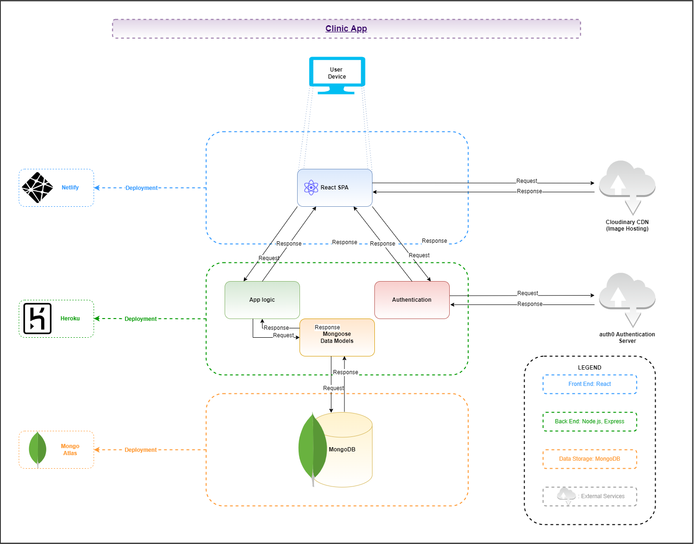
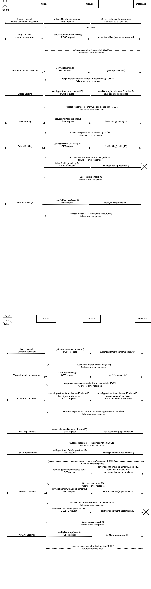

# Medical Clinic Booking App

---

## Links

- [Deployed app]()
- [Source code]()

---

## General Description and Purpose

### Purpose
Our app connects a medical practice with its patients. It provides an "all-in-one" solution to booking and managing appointments, viewing and selecting practice services, and accessing notes and resources from an appointment.

For medical practices, this will allow a platform to advertise available services, track appointments, and streamline the booking process.

For doctors, this will allow the managing and tracking of appointments, and as easy way to update availability throughout the day/wekk.

For patients, the app presents a simple way to book appointments and select from various medical services.

### Features
The app will include information about the services provided by the practice - general consultations, specific assessments and treatments, care plan consultations, etc. End-users from the practice will be able to quickly check and manage appointments, manage availability, access information for the patient who made the appointment, and attach any additional files or resources.

Patient end-users will be able to view doctor availability, make and manage appointments, and access any included information for upcoming or past appointments. Patients will also be able to manage personal information provided to the practice through their user accounts, and close an account at any time.

### Target Audience

The app is intended for medical practices, as a simple way to to deliver online presence and a simple booking experience for patients.

### Tech Stack

Our app is built on the following technologies:

#### Front End
- CSS
- HTML
- React
- <INSERT CSS FRAMEWORK HERE>

#### Back End
- Express
- MongoDB
- Mongoose
- Node.js

#### Third-party Services
- Cloudinary
- Heroku
- Netlify
- MongoDB Atlas

---

## Application Architecture Diagram

---

## Dataflow Diagram 

---

## UML Sequence Diagram

---

## User Stories

- As a patient, I want to be able to book and manage appointments online, to save hassle when I need to see a doctor.
- As a patient, I want to create/edit an account with my details to make bookings easier.
- As a patient, I want to update or delete my account and information, so I can feel in control of my personal information.
- As a patient, I want see a doctor of my choice, so I feel more comfortable with my appointment.

- As a doctor, I want to be able to create a profile with information about myself, to introduce myself to potential patients.
- As a doctor, I want to be able to provide and manage information about my availability, so patients know when they can see me.
- As a doctor, I want to be able to view and manage my appointments, so I can be prepared for my patients.

- As a doctor, I want to be able to view and manage my appointments, so I can be prepared for my patients

- As a practice manager, I want to show the the clinic services, so patients can find the services they need.
- As a practice manager, I want to show the availability of our doctors, so patients know when they can make appointments.
- As a practice manager, I want to be able to view and manage bookings easily, so I can organise the day's work.
- As a practice manager, I want combine our online presence with an easy booking system, so patients can find everything they need in one place.

---
  
## Wireframes

---

## Kanban Screenshots

---
