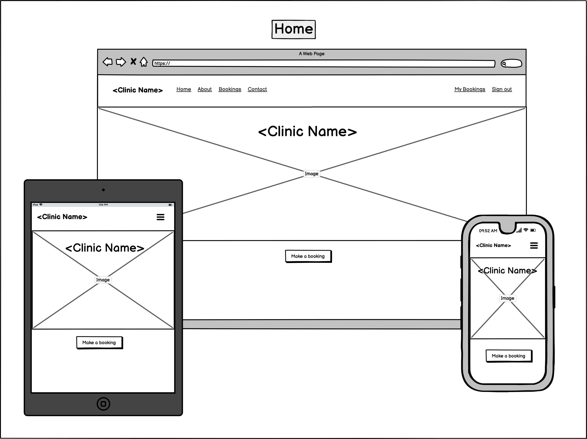
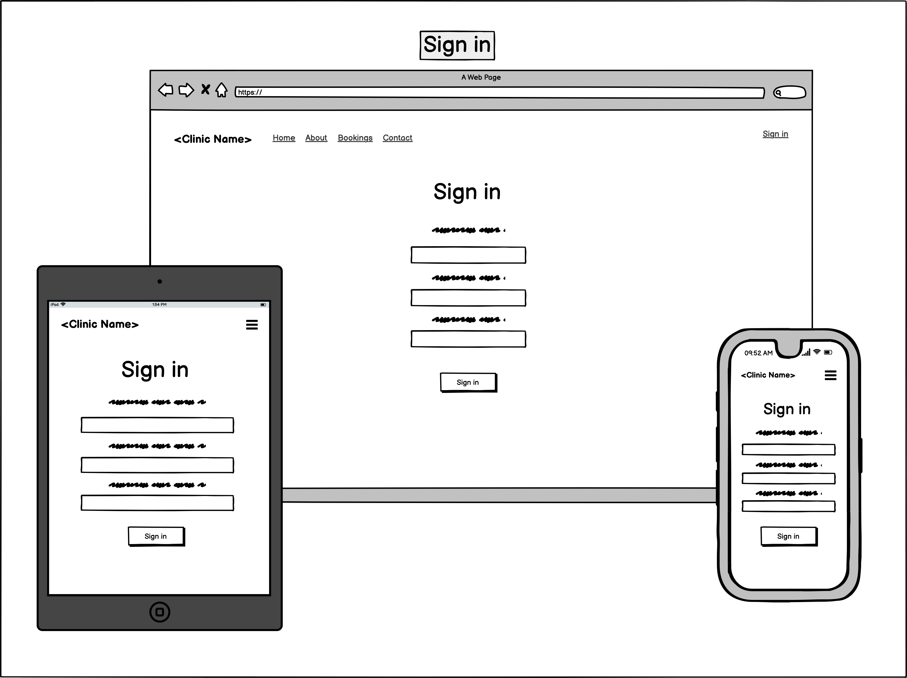
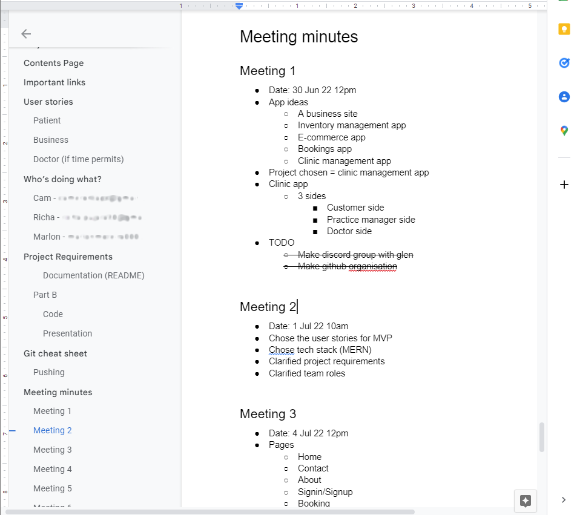
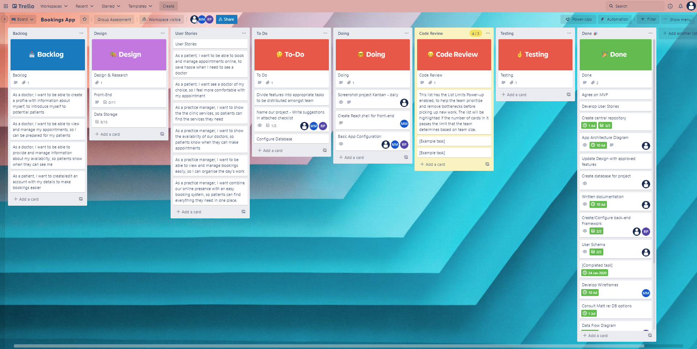
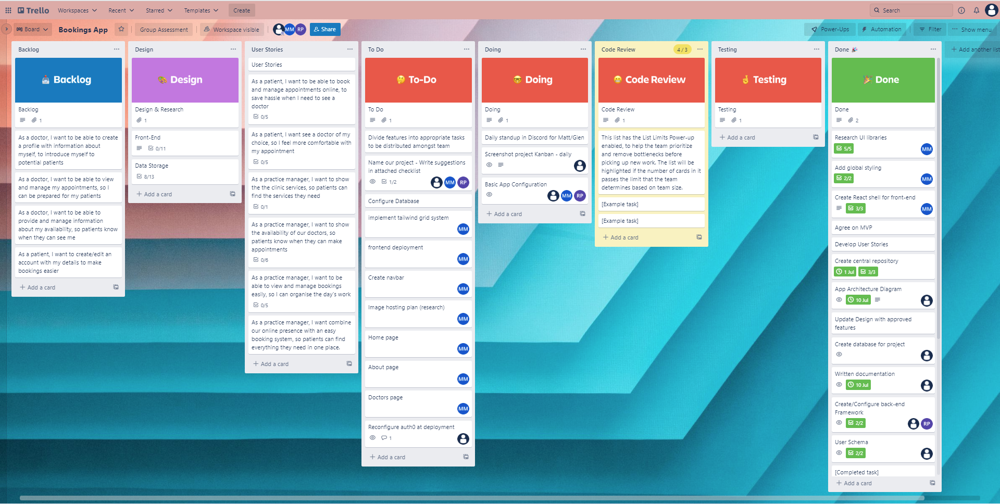
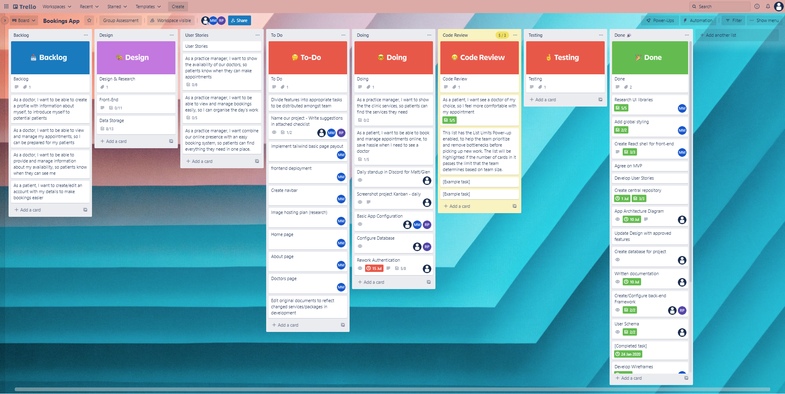
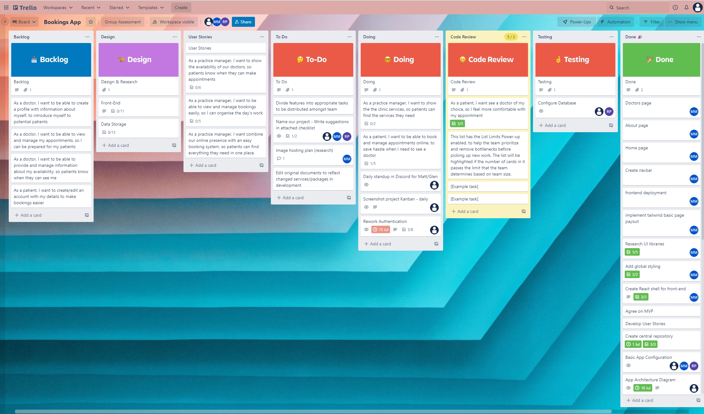
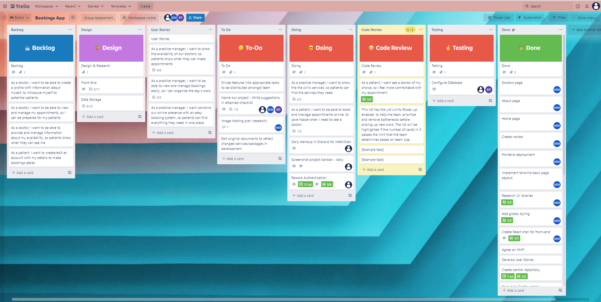
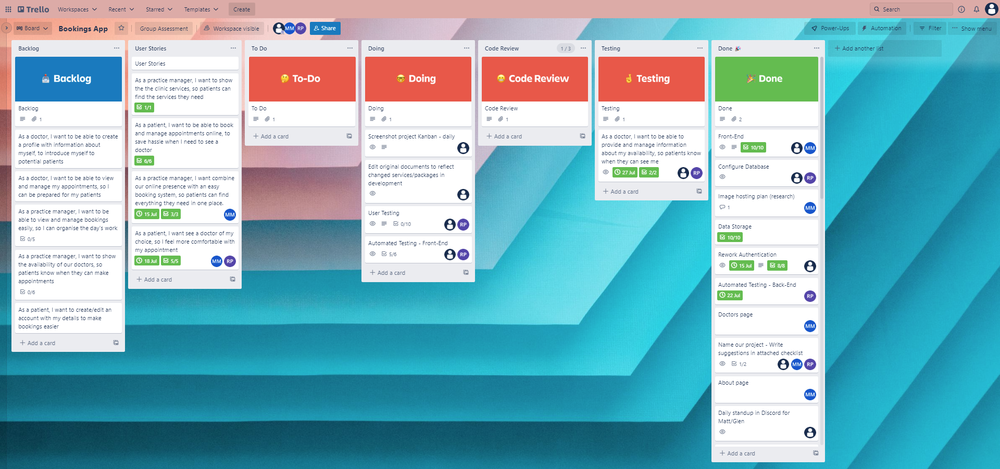
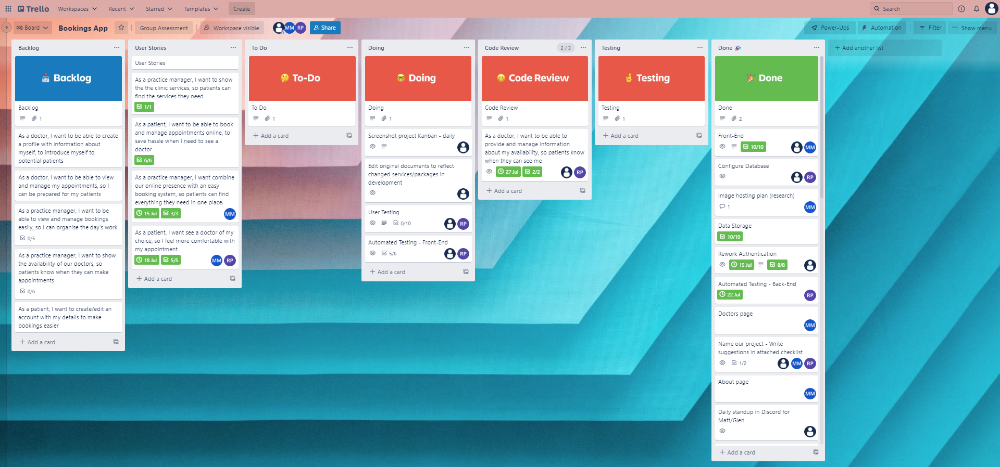

# Medical Clinic Booking App

## General Description and Purpose

The [repo](https://github.com/Putting-The-A-Team-in-CA) contains the source code and other assets for our MERN-stack application. The deployed version of the app can be found [here](https://clinic-concierge.netlify.app/)

### Purpose
Our app connects a medical practice with its patients. It provides an "all-in-one" solution to booking and managing appointments, viewing and selecting practice services, and accessing notes and resources from an appointment. The app caters for three types of user:

- **Medical Clinic Managers:** The app will allow clinic managers to platform to advertise available services, track appointments, and streamline the booking process.

- **Doctors:** The app allows the management and tracking of appointments, and provides an easy way to update availability throughout the day/week.

- **Patients:** The app presents a simple way to book appointments and select from various medical services.

### Features

The website section of the app allows practices to advertise their services (general consultations, care plan consultations, etc) as well as provide information about their doctors. Contact information and other details for the practice can also be included, to expand online presence. The booking section of the app allows end-users from the practice to quickly check and manage appointments, and set/manage availability of their practitioners.

Patient end-users are able to sign up for and account and login. After this, they can view doctor availability, make and manage appointments, and access any included information for upcoming or past appointments. Patients will also be able to manage personal information provided to the practice through their user accounts, and close an account at any time.

Secure login and sign-up will be provided through a blend of in-house configuration and third-party services.

### Target Audience

The app is intended for medical practices, as a simple way to to deliver online presence and a simple booking experience for patients.

### Tech Stack

Our app is built on the following technologies:

#### Front End
- CSS
- HTML
- React
- Ant Design
- Tailwind

#### Back End
- Express
- JWT
- MongoDB
- Mongoose
- Node.js

#### Third-party Services
- Heroku
- Netlify
- MongoDB Atlas

---

### Libraries

This project made use of a range of libraries (some mentioned above) for various functions and features.

#### Front-End
Following libraries are used:
- [React](https://reactjs.org/): a JavaScript library for building interactive user interfaces.
- [Ant Design](https://ant.design/): component library was also used in developing the user interface, for form and input components, buttons, messages and alerts, date and time pickers, etc. 
- [React Hot-Toast](https://react-hot-toast.com/): was also used for messaging and alerts in some areas of the app.
- [Axios](https://axios-http.com/): is used to handle many HTTP requests, API calls, and queries
- [cross-fetch](https://www.npmjs.com/package/cross-fetch): used for HTTP requests to backend services
- [Tailwind](https://tailwindcss.com/): was used extensively for styling
- [Vite](https://vitejs.dev/): for scaffolding/app creation.

#### Front-End Testing
Following libraries are used:
- [Vitest](https://vitest.dev/): was used testing framework
- [React Testing Library](https://testing-library.com/): for UI component testing
- [JSDOM](https://github.com/jsdom/jsdom): for emulating web browsers during unit and integration testing
- [Node Fetch](https://www.npmjs.com/package/node-fetch): was used to allow for `fetch` calls
- [MSW](https://mswjs.io/): to facilitate API mocking for integration testing

#### Back-End
- [bcrypt.js](https://github.com/dcodeIO/bcrypt.js#readme): used for encrypting/decrypting the passwords saved in database.
- [cors](https://github.com/expressjs/cors#readme): used for middleware in the express app
- [dotenv](https://github.com/motdotla/dotenv#readme): storing environment configuration
- [Express](http://expressjs.com/): as the web framework for building the backend app
- [http-status-codes](https://github.com/prettymuchbryce/http-status-codes#readme): for HTTP status codes enumeration for API request's response.
- [Joi](https://github.com/sideway/joi#readme): for validating the API request body
- [Joi password complexity](https://github.com/kamronbatman/joi-password-complexity#readme): for validating that password in the request body meets the required criteria
- [jsonwebtoken](https://github.com/auth0/node-jsonwebtoken#readme): used for handling JWT tokens used for authentication
- [Mongoose](https://mongoosejs.com/): as object modeling tool which works with MongoDB.

#### Back-End Testing
Following libraries are used:
- [Jest](https://jestjs.io/): as the testing framework for unit and integration tests.
- [Supertest](https://github.com/visionmedia/supertest#readme): for HTTP assertions for API request.
- [Nodemon](https://nodemon.io/): for monitoring the changes in project and re-running or re-deploying the application in local.
  
## Application Architecture Diagram

---

## Dataflow Diagram 

---

## UML Sequence Diagram

---

## User Stories

| User    | Action                                                      | Result                                                                                      |
| ------- | ----------------------------------------------------------- | ------------------------------------------------------------------------------------------- |
| Patient | Create an account                                           | So I can securely and conveniently book appointments                                        |
| Patient | Sign in to my account                                       | So I can access services in the app                                                         |
| Patient | Add my personal details to my account                       | So I can save time when booking with my doctor                                              |
| Patient | Edit my personal details on my account                      | So I can provide the clinic with up-to-date information and control my personal information |
| Patient | Book an appointment online                                  | So I can book a doctor conveniently and easily                                              |
| Patient | Choose a doctor for my appointment                          | So I can feel more comfortable about which doctor I am seeing                               |
| Patient | Choose a date and time for my appointment                   | So I can fit the appointment into my busy schedule                                          |
| Patient | Add a comment when booking an appointment                   | So I can provide the doctor with any extra information                                      |
| Patient | See the details of a booking                                | So I can confirm the booking details                                                        |
| Patient | View all my current bookings                                | So I can see how many bookings I have                                                       |
| Patient | View all my previous bookings                               | So I can see details from past appointments                                                 |
| Patient | Access any medical reports/scans from previous appointments | So I can download them to use for other purposes                                            |
| Patient | Make changes to a booking                                   | So I can manage bookings around any changes in my schedule                                  |
| Patient | Get notified of any changes to my bookings                  | So I can be properly prepared and organise my time                                          |
| Patient | Cancel a booking                                            | So I can adapt to my changing needs                                                         |
| Patient | Delete my account                                           | So I can control my personal information and reduce my online footprint                     |
| Admin   | View a patients booking details                             | So doctors can prepare for their appointments                                               |
| Admin   | View all current bookings for each doctor                   | So I can plan the week                                                                      |
| Admin   | Edit a patients booking                                     | So I can adjust appointments if any changes arise                                           |
| Admin   | Delete a patients booking                                   | So I can deal with cancellations and other changes                                          |
| Admin   | Provide doctor availabilities                               | So patients know when they can book appointments                                            |
| Admin   | Get notified when a patients booking changes                | So doctors can adjust their schedule/plans as needed                                        |
| Admin   | Combine our online presence with an easy booking system     | So patients can find everything they need in one place                                      |
| Admin   | Advertise about the services we provide                     | So potential patients understand what we do                                                 |
| Admin   | Provide a bio for all the doctors                           | So patients can choose a doctor they're comfortable with                                    |

---
  
## Wireframes

---

## Testing

This app was tested using both automated and manual testing.

Automated unit and integration tests were written extensively for the back-end and for key front-end features.

A suite of manual user tests were performed on both development and deployed versions of the app. Documentation for these tests can be seen [here](https://docs.google.com/spreadsheets/d/1JszM7IDBI0lIma2_TuKwoHhBxzvCLvAZxbA28Op6RDk/edit?usp=sharing)

---

## Project Management

The management of this project involved several strategies and tools. A Kanban board was maintained throughout the project to track progress, supported by daily stand-ups amongst team members. Additionally, regular meetings were held both in a combination of text-based, audio, and video formats.

The project faced significant challenges to proper planning and organisation through a series of unexpected personal emergencies experienced by one of the team members. This significantly impacted the capacity of the team through much of development.

Despite this, development continued in a relatively orderly fashion, with daily stand-ups continuing to report progress on different features. As more complex features were tackled, requiring integration of front- and back-end components, daily collaborative development sessions became the norm to allow team members to work together and troubleshoot issues.

As development progressed, it was necessary to adjust the scope of the project, as initial plans proved to be overly ambitious given the limited time allowed for the project, as well as the challenges faced during this period.

Tasks were divided amongst the group based on the preferences of individual team-members, allowing each team member to work on aspects of the project of particular interest to them. Initial roles broadly covered front- and back-end development, with a third developer offering support for both. Once the basic framework of the product had been developed, tasks became increasingly granular as focus shifted to specific features (e.g., authorisation, setting availability, managing appointments, etc.), integration, deployment, and testing.

Internal documentation was also maintained throughout the project recording essential information about the app, assigned tasks, and minutes from team meetings.

### Kanban Screenshots

